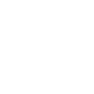
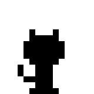

# PixelIcons

PixelIcns is a web tool with pixelated icons.

## Ones of our icons
### PNG





### SVG


## How I import PixelIcns in my HTML page?

> [!NOTE] 
> Recomended to use a dark screen in your HTML

> [!NOTE]
> The icons have enabled to size, e.t.c.

If you want SVG icons, you have here a example how to use it:

```html
<!DOCTYPE html>
<html>
    
    <body>
        <p>Hi.</p>
        
    </body>
</html>
```

But if you want to use PNG icons, you have here a example how to use it:

```html
<!DOCTYPE html>
<html>
    <body>
        <p>Hi.</p>
        
    </body>
</html>
```